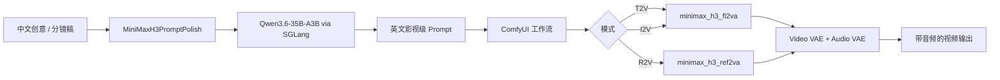

# AI Film & Short Drama Generation System


> 写实 AI 电影 / 短剧本地生成与生产流水线（ComfyUI + MiniMax-H3）

面向 **AI 出图 / 出视频 / 电影级写实短片生成** 的本地部署工程。基于 [ComfyUI](https://github.com/Comfy-Org/ComfyUI) 工作流框架，集成 **MiniMax-H3** 音视频联合生成模型，并配套 **Qwen3.6** 提示词润色服务，支持文生视频（T2V）、图生视频（I2V）、参考生视频（R2V）。

> 仓库定位：部署配置、模板工作流、运维脚本与项目文档。**不包含** 百 GB 级模型权重、完整 ComfyUI 上游源码（请按文档自行拉取），也**不提供**完整成片与原始工程素材——[成果展示](#成果展示) 仅为低分辨率预览。

---

## 项目简介

本项目服务于「写实 AI 电影 / 短剧 / 影视内容」生产链路：从中文创意草稿 → 英文影视级提示词 → ComfyUI 节点图推理 → 带立体声音轨的视频片段。可扩展到分镜、角色一致性、多镜头拼接等后续能力。

当前阶段已具备：

- MiniMax-H3 BF16 权重本地加载（约 129G）
- 33 套可直接导入的模板工作流：视频 T2V / I2V / R2V、电影级关键帧/分镜/连贯片管线、「大师」六件套，以及《万灵绘卷》琴书画系列、QwenImage / FLUX2 出图、洗图改图与室内效果图管线
- ComfyUI `0.31.0` 一键启停脚本（含 PPU 加速参数与注意力后端切换）
- 基于 SGLang 的 Qwen3.6-35B-A3B 提示词润色自定义节点（已接入 MiniMax 官方 H3 提示词写作技能）
- 写实短剧全链：majicFlus 人物出图 + PuLID 跨镜脸锁 + FaceDetailer/USDU 画质链 + H3 首尾帧接戏 + 48k 音画对齐拼接（见 [`docs/production-asset-inventory.md`](docs/production-asset-inventory.md)）

---

## 成果展示

写实短剧《城市雨夜漫步》——雨夜城市街道、单角色、暖调霓虹与湿面反射，全片由本系统 **首尾帧双控 I2V + MiniMax-H3** 链路产出（24fps，音画同出）。

> **关于素材**：以下为**预览级素材**（压缩静帧 + 数秒动图），仅用于展示画面风格与镜头质感。
> **完整成片不公开、不随仓库分发**；仓库内不含任何原始工程素材、人物参考图与完整视频文件。

### 精选静帧

| 雨夜空街 · 场景定调 | 街头行走 · 人物入画 | 橱窗经过 · 浅景深 |
|:---:|:---:|:---:|
|  |  |  |

| 全身转身 · 中景 | 回眸 · 暖光 | 回眸 · 暗调 |
|:---:|:---:|:---:|
|  |  |  |

| 角色定妆 · 竖构图 | 双眼特写 · 情绪落点 |
|:---:|:---:|
|  |  |

### 动态预览（各约 3 秒，静音循环）

| 开场 · 雨夜行走 | 背影 · 街景推移 |
|:---:|:---:|
|  |  |

| 唇部特写 · 暗调 | 收尾 · 回眸 |
|:---:|:---:|
|  |  |

> 全部素材版权归作者所有；**未经授权不得转载、二次分发或用于任何商业用途**。
> 展示素材均为低分辨率预览，仓库不提供原始文件。

---

## 功能与作用

| 能力 | 说明 |
|---|---|
| 文生视频 T2V | 文本直接生成带音频的视频镜头 |
| 图生视频 I2V | 以首帧/尾帧图像驱动运镜与动作 |
| 参考生视频 R2V | 以参考图保持角色/产品一致性 |
| 提示词润色 | 中文草稿 → MiniMax-H3 友好英文提示（含运镜、光影、音效） |
| 音画同出 | H3 原生联合生成立体声音轨，减少后期配音成本 |
| 服务化部署 | ComfyUI（8188）+ SGLang 润色（8030）前后台启停 |

**典型用途**

- AI 漫剧 / 短剧分镜与镜头预演
- 产品广告、角色 PV、概念片快速出片
- 教学演示、内容工作室批量化素材生产
- 二次开发：对接业务 API、队列调度、多卡批处理

---

## 技术路线



**栈摘要**

| 层级 | 选型 |
|---|---|
| 编排与 UI | ComfyUI 0.31.0（节点图 / API） |
| 视频大模型 | MiniMax-H3（fl2va / ref2va pruned BF16） |
| 文本编码 | Qwen3-VL-32B（H3 配套 text encoder） |
| 提示词 LLM | Qwen3.6-35B-A3B 全量 BF16 + SGLang（TP=2） |
| 加速硬件 | 8× PPU-ZW810E（单卡 96GB，合计约 768GB 显存） |
| 运行环境 | Ubuntu 24.04、Conda 环境 `ComfyUI`、海光 Hygon CPU |

---

## 服务器硬件配置（当前部署机）

| 项目 | 规格 |
|---|---|
| 加速卡 | **8 × PPU-ZW810E**，单卡显存 **98304 MiB（96GB）**，功耗上限约 400W |
| 显存合计 | 约 **768 GB** |
| CPU | **Hygon C86-4G (OPN:7490)** × 2 Socket，64 核/路，合计 **256 逻辑线程** |
| 内存 | 约 **1.5 TiB**（`MemTotal ≈ 1580 GB`） |
| 系统 | Ubuntu 24.04.2 LTS（x86_64） |
| 存储策略 | 运行权重在 `${MODEL_ROOT}`；`${WORKSPACE_ROOT}`（ossfs）仅作持久备份 |

更完整的探测输出见 [`docs/hardware_snapshot.txt`](docs/hardware_snapshot.txt)。

> 说明：本机加速卡为国产 PPU（`nvidia-smi`/`ppu-smi` 兼容展示为 PPU-ZW810E），与常规 NVIDIA 卡在驱动与算子栈上有差异，部署时需使用适配后的 PyTorch / 启动脚本。

---

## 已部署大模型

### 1）MiniMax-H3（主推理）

| 组件 | 文件 | 约大小 |
|---|---|---:|
| Diffusion（FL2VA） | `minimax_h3_fl2va_pruned_bf16.safetensors` | 38G |
| Diffusion（Ref2VA） | `minimax_h3_ref2va_pruned_bf16.safetensors` | 38G |
| Text Encoder | `qwen3vl_32b_minimax_h3_bf16.safetensors` | 48G |
| Video VAE | `minimax_h3_video_vae_fp16.safetensors` | 4.9G |
| Audio VAE | `minimax_h3_audio_vae_fp32.safetensors` | 578M |
| **合计** | | **≈ 129G** |

- 运行路径：`${MODEL_ROOT}/MiniMax-H3-ComfyUI`
- 备份路径：`${WORKSPACE_ROOT}/ComfyUI/models_backup/MiniMax-H3-ComfyUI`
- 上游参考：[MiniMaxAI/MiniMax-H3](https://huggingface.co/MiniMaxAI/MiniMax-H3)

### 2）Qwen3.6-35B-A3B（提示词润色）

| 项目 | 值 |
|---|---|
| 路径 | `${MODEL_ROOT}/Qwen3.6-35B-A3B` |
| 大小 | ≈ 67G（全量 BF16） |
| 服务 | SGLang，默认端口 `8030`，`TP_SIZE=2`，默认占用 GPU `4,5` |
| 对外名 | `qwen3.6-fast`（OpenAI 兼容 `/v1/chat/completions`） |

### 3）同机其他模型（非本仓库主链路，可共用）

服务器上另有 Qwen3.6-27B、Embedding、检测器等，详见机内清单；本项目主链路仅依赖 **H3 + Qwen3.6-35B-A3B**。

权重清单说明：[`docs/models.md`](docs/models.md)。

---

## ComfyUI 框架与工作流

### 框架

- ComfyUI 版本：`0.31.0`（`comfyui_version.py`）
- WebUI / API 默认：`http://0.0.0.0:8188`
- 额外模型路径：`configs/extra_model_paths.yaml`
- 自定义节点：`custom_nodes/minimax_h3_prompt_polish`（`MiniMax H3 提示词润色 (Qwen)`），内置 MiniMax 官方 H3 提示词写作技能参考（`skills/references/`），按模式（T2VA/I2VA/FL2VA/L2VA/Ref2VA）套用官方字段名、镜头标记与音频段落规范改写提示词

### 模板工作流（33 个）

#### 《万灵绘卷》琴书画系列（古风短剧生产链）

| 文件 | 用途 |
|---|---|
| [`workflows/万灵绘卷_S01_抚琴近景.json`](workflows/万灵绘卷_S01_抚琴近景.json) | S01 抚琴近景关键帧出图 |
| [`workflows/万灵绘卷_S01_抚琴图生视频.json`](workflows/万灵绘卷_S01_抚琴图生视频.json) | S01 抚琴镜头图生视频 |
| [`workflows/万灵绘卷_S02_仙庭全景.json`](workflows/万灵绘卷_S02_仙庭全景.json) | S02 仙庭全景空镜 |
| [`workflows/万灵绘卷_S02_拉远庭院.json`](workflows/万灵绘卷_S02_拉远庭院.json) | S02 拉远运镜镜头 |
| [`workflows/万灵绘卷_S03_男女对弈.json`](workflows/万灵绘卷_S03_男女对弈.json) | S03 男女对弈双人镜头 |
| [`workflows/万灵绘卷_S03_对弈图生视频.json`](workflows/万灵绘卷_S03_对弈图生视频.json) | S03 对弈镜头图生视频 |

#### 视频生成（MiniMax-H3）

| 文件 | 用途 |
|---|---|
| [`workflows/H3_文生视频.json`](workflows/H3_文生视频.json) | H3 文生视频（带音轨） |
| [`workflows/H3_图生视频_首尾帧.json`](workflows/H3_图生视频_首尾帧.json) | H3 首尾帧 I2VA 接戏镜头 |
| [`workflows/H3_角色写真_图生视频.json`](workflows/H3_角色写真_图生视频.json) | 角色写真图生视频 |
| [`workflows/video_minimax_h3_t2v_bf16.json`](workflows/video_minimax_h3_t2v_bf16.json) / [`i2v`](workflows/video_minimax_h3_i2v_bf16.json) / [`r2v`](workflows/video_minimax_h3_r2v_bf16.json) | H3 官方模板（BF16） |
| [`workflows/video_minimax_h3_t2v.json`](workflows/video_minimax_h3_t2v.json) | H3 文生视频（通用版） |
| [`workflows/h3_text_prompt_keyframe_video_bf16.json`](workflows/h3_text_prompt_keyframe_video_bf16.json) | 电影级关键帧分镜管线 |

#### 出图与改图

| 文件 | 用途 |
|---|---|
| [`workflows/麦橘人物_文生图.json`](workflows/麦橘人物_文生图.json) | 麦橘人物文生图 + PuLID 脸锁 |
| [`workflows/全链路_中文润色_麦橘_H3.json`](workflows/全链路_中文润色_麦橘_H3.json) | 中文润色 → 麦橘出图 → H3 全链路 |
| [`workflows/FLUX2_空镜场景板.json`](workflows/FLUX2_空镜场景板.json) | FLUX.2 高光感场景空镜板 |
| [`workflows/FLUX2_文生图练习.json`](workflows/FLUX2_文生图练习.json) | FLUX.2 文生图练习模板 |
| [`workflows/QwenImage2512_文生图.json`](workflows/QwenImage2512_文生图.json) | QwenImage 2512 文生图 |
| [`workflows/QwenImage3_文生图_云端.json`](workflows/QwenImage3_文生图_云端.json) / [`图生图`](workflows/QwenImage3_图生图_云端.json) | QwenImage3 云端文生图 / 图生图 |
| [`workflows/洗图_反推_FLUX2图改图.json`](workflows/洗图_反推_FLUX2图改图.json) | 洗图反推 + FLUX2 图改图 |
| [`workflows/室内效果图_毛胚平面改图.json`](workflows/室内效果图_毛胚平面改图.json) | 毛胚平面改图出室内效果图 |
| [`workflows/film_zh2prompt_flux_h3.json`](workflows/film_zh2prompt_flux_h3.json) | 中文草稿转影视级提示词并出图 |
| [`workflows/film_master_zh_prompt_flux_face_upscale_h3.json`](workflows/film_master_zh_prompt_flux_face_upscale_h3.json) | 电影级母版出图（含面部修复与高清放大） |

#### 连贯片与注解

| 文件 | 用途 |
|---|---|
| [`workflows/film_coherent_photoreal_chain.json`](workflows/film_coherent_photoreal_chain.json) | 连贯片生产链注解（写实短剧主路径） |

#### 「大师」六件套（写实短剧标准生产链）

| 文件 | 用途 |
|---|---|
| [`workflows/大师_01_文字生图_麦橘人物_PuLID.json`](workflows/大师_01_文字生图_麦橘人物_PuLID.json) | 麦橘人物文生图 + PuLID 脸锁（角色圣经） |
| [`workflows/大师_02_场景板_FLUX2空镜.json`](workflows/大师_02_场景板_FLUX2空镜.json) | FLUX.2 高光感场景空镜板 |
| [`workflows/大师_03_图生视频_H3_首尾帧.json`](workflows/大师_03_图生视频_H3_首尾帧.json) | H3 首尾帧 I2VA 接戏镜头 |
| [`workflows/大师_04_文生视频_H3.json`](workflows/大师_04_文生视频_H3.json) | H3 文生视频（带音轨） |
| [`workflows/大师_05_全链路_中文润色_麦橘_修脸_放大_H3.json`](workflows/大师_05_全链路_中文润色_麦橘_修脸_放大_H3.json) | 全链路母版：中文润色 → 麦橘出图 → 修脸 → 放大 → H3 |
| [`workflows/大师_06_角色写真_图生视频.json`](workflows/大师_06_角色写真_图生视频.json) | 角色写真图生视频 |
| [`workflows/大师_API_连贯链路注解.json`](workflows/大师_API_连贯链路注解.json) | API 格式连贯链路注解（供脚本调度） |

配套文档：[`workflows/README_大师工作流使用说明.txt`](workflows/README_大师工作流使用说明.txt)、[`workflows/给GPT_制片管线使用说明.md`](workflows/给GPT_制片管线使用说明.md)（制片管线对接说明）

在 ComfyUI 中：`Load` → 选择上述 JSON → 修改提示词 / 分辨率 / 上传参考图 → `Queue Prompt`。

官方模板对照：

- [I2V](https://github.com/Comfy-Org/workflow_templates/blob/main/templates/video_minimax_h3_i2v.json)
- [T2V](https://github.com/Comfy-Org/workflow_templates/blob/main/templates/video_minimax_h3_t2v.json)
- [R2V](https://github.com/Comfy-Org/workflow_templates/blob/main/templates/video_minimax_h3_r2v.json)

---

## 目录结构

```text
ai-manju-shengcheng-xitong/
├── README.md
├── LICENSE
├── .gitignore
├── configs/
│   └── extra_model_paths.yaml      # MiniMax-H3 路径注册示例
├── workflows/                      # 34 套模板工作流（万灵绘卷系列 + 视频 + 出图改图 + 连贯片 + 城市雨夜漫步图生视频）
├── showcase/                       # 成果展示（预览静帧 + 数秒动图；均为低分辨率预览，不含原始素材）
├── scripts/                        # ComfyUI / SGLang 启停与注册
│   ├── film/                       # 写实短剧自动化（24 个：公共管线库/万灵绘卷出片/人物圣经/首尾帧链/RAM守卫/48k拼接/洗图与室内管线）
│   ├── comfyui_start.py
│   ├── comfyui_start_bg.py
│   ├── comfyui_stop.py
│   ├── comfyui_service.py
│   ├── sglang_start.py
│   ├── sglang_start_bg.py
│   ├── sglang_stop.py
│   ├── sglang_service.py
│   └── register_h3_models.py
├── custom_nodes/
│   └── minimax_h3_prompt_polish/   # 提示词润色节点
└── docs/
    ├── hardware_snapshot.txt
    ├── models.md
    ├── deployment.md
    └── commercial.md
```

---

## 快速开始

### 1. 准备 ComfyUI 与权重

```bash
# 拉取 ComfyUI（示例）
git clone https://github.com/Comfy-Org/ComfyUI.git
cd ComfyUI
# 按官方文档创建 conda/venv 并安装依赖（需匹配本机 PPU/CUDA 栈）

# 下载 MiniMax-H3 ComfyUI 打包权重到本地盘，例如：
# ${MODEL_ROOT}/MiniMax-H3-ComfyUI/{diffusion_models,text_encoders,vae}/

# 复制本仓库自定义节点
cp -r custom_nodes/minimax_h3_prompt_polish /path/to/ComfyUI/custom_nodes/
```

### 2. 注册模型路径

编辑或生成 `extra_model_paths.yaml`（可参考 `configs/extra_model_paths.yaml`），保证指向本地 H3 目录，然后：

```bash
python scripts/register_h3_models.py
```

### 3. 启动润色 LLM（可选但推荐）

```bash
# 前台
python scripts/sglang_start.py
# 或后台
python scripts/sglang_start_bg.py
```

### 4. 启动 ComfyUI

```bash
python scripts/comfyui_start.py
# 浏览器打开 http://127.0.0.1:8188
```

### 5. 导入工作流并出片

加载 `workflows/video_minimax_h3_*.json`，用润色节点处理中文草稿后排队生成。

常用环境变量（可按需覆盖）：

| 变量 | 默认 | 含义 |
|---|---|---|
| `COMFYUI_ROOT` | `${COMFYUI_ROOT}` | ComfyUI 根目录 |
| `COMFYUI_PORT` | `8188` | WebUI 端口 |
| `COMFYUI_H3_MODEL_SRC` | `${MODEL_ROOT}/MiniMax-H3-ComfyUI` | H3 权重 |
| `SGLANG_POLISH_PORT` | `8030` | 润色服务端口 |
| `SGLANG_POLISH_GPUS` | `4,5` | 润色占用卡 |
| `COMFYUI_LLM_BASE_URL` | `http://127.0.0.1:8030/v1` | 润色 API |

---

## 商用说明

详见 [`docs/commercial.md`](docs/commercial.md)。要点：

- **本仓库代码**：以仓库 `LICENSE` 为准（MIT），可用于二次开发与商业集成（需保留版权声明）。
- **MiniMax-H3**：遵循 MiniMax H3 Community License，商用前请阅读官方协议。
- **Qwen / 其它第三方权重**：遵循各自模型许可证与可接受使用政策。
- **内容合规**：生成内容需遵守当地法律法规与平台规范，禁止用于违法违规用途。

---

## 路线图（简）

- [x] MiniMax-H3 BF16 本地部署与三套模板工作流
- [x] Qwen 提示词润色节点 + SGLang 服务脚本
- [ ] 漫剧分镜批处理与镜头级队列
- [ ] 角色 / 场景资产库与一致性管线
- [ ] 对外 REST/队列 API 与鉴权
- [ ] 多卡并行调度与成本监控面板

---

## 作者

- GitHub：[catiseyeqaq](https://github.com/catiseyeqaq)（YuXuanLin）
- 方向：人工智能应用落地、多模态生成与行业智能系统

---

## 致谢

- [Comfy-Org/ComfyUI](https://github.com/Comfy-Org/ComfyUI)
- [MiniMaxAI/MiniMax-H3](https://huggingface.co/MiniMaxAI/MiniMax-H3)
- [Qwen](https://github.com/QwenLM) / SGLang

---

## License

本仓库文档与自研脚本默认采用 [MIT License](LICENSE)。第三方模型与上游框架版权归原作者所有。
